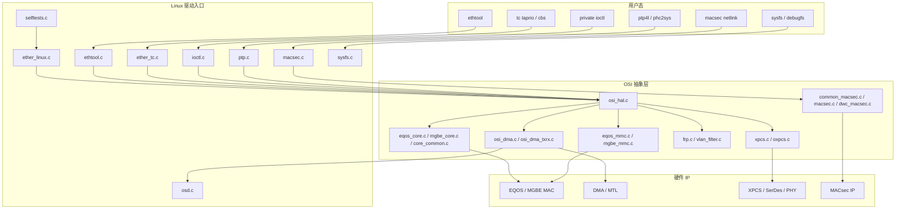
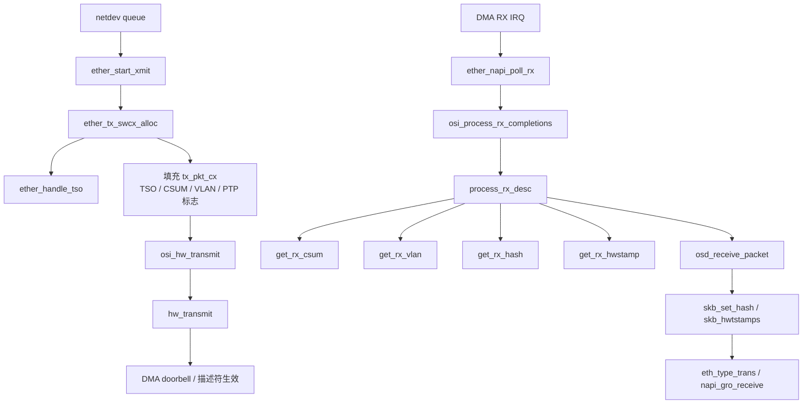
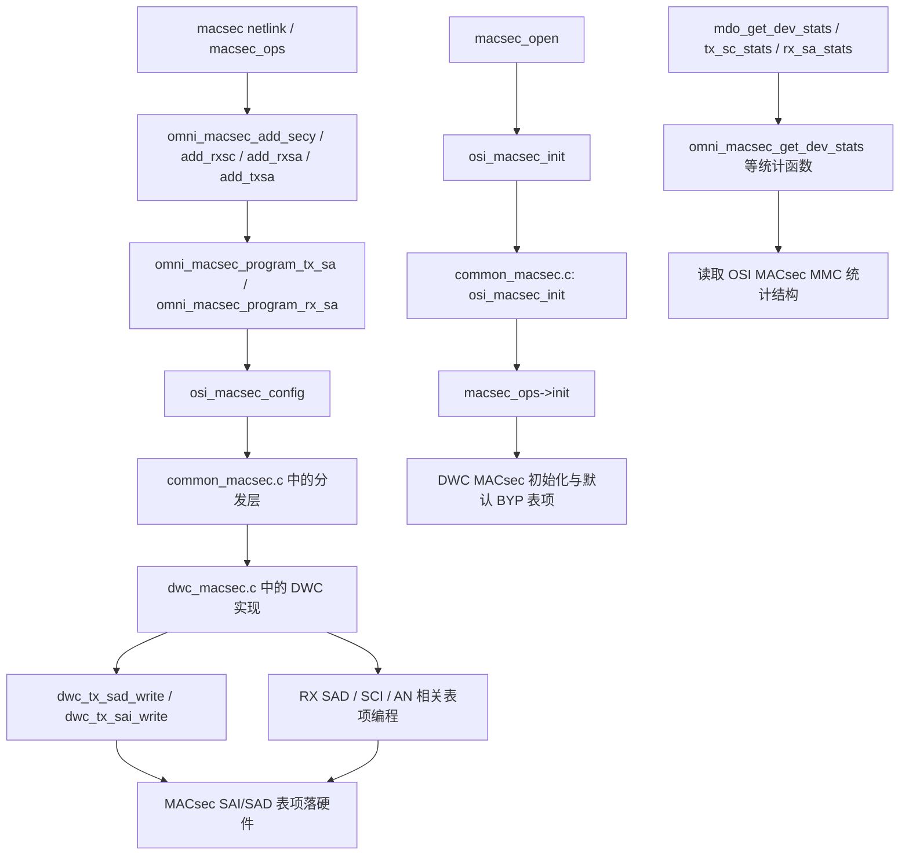
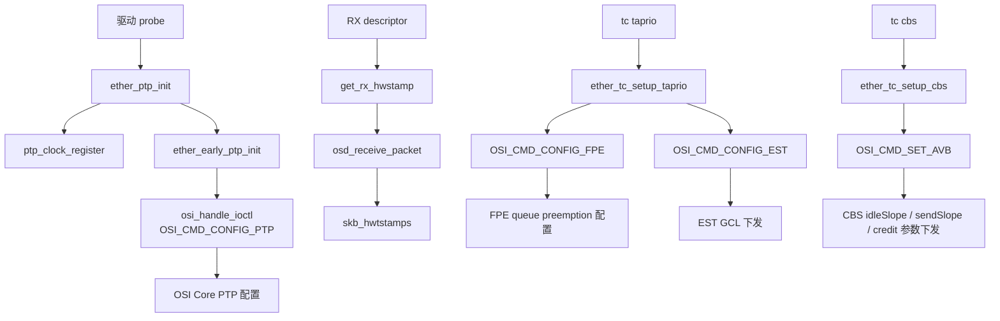

# 基于 ETHSS FEATURES 的 omnieth 代码梳理

## 1. 分析范围与判断口径

- 原始 ETHSS FEATURES.docx 不是可复制文本，而是 3 张特性表截图。截图里的类别包括：network interface、host interface、Network、Security、offloading、TSN、Flow Steering、debug。
- 本文不是按目录做泛化介绍，而是按截图中列出的 feature，逐项映射到当前工作区 omnieth 的真实代码。
- 文中状态分 3 类：
  - 已接入：能看到明确的 Linux 驱动入口和对应 OSI/HW 处理路径。
  - 部分接入：能看到硬件能力位或底层支持，但当前驱动没有完整的用户接口，或只接了一部分。
  - 未见明确入口：当前代码里没有找到清晰的控制路径，更多像硬件规格项。

## 2. 代码分层

| 层次 | 关键文件 | 作用 |
| --- | --- | --- |
| Linux 驱动胶水层 | ether_linux.c, ethtool.c, ioctl.c, sysfs.c, ether_tc.c, ptp.c, macsec.c, selftests.c | 对接 net_device、ethtool、ioctl、sysfs、TC、PTP、MACsec、selftest |
| OSI Core 层 | hardware/osi/core/osi_hal.c, eqos_core.c, mgbe_core.c, core_common.c, xpcs.c, frp.c, vlan_filter.c, eqos_mmc.c, mgbe_mmc.c | 做 MAC/XPCS/FRP/VLAN/MMC 的硬件抽象 |
| OSI DMA 层 | hardware/osi/dma/osi_dma.c, osi_dma_txrx.c, eqos_dma.c, mgbe_dma.c, eqos_desc.c, mgbe_desc.c | 做描述符、DMA 通道、中断和 Tx/Rx 完成处理 |
| PHY/XPCS 层 | hardware/osi/core/xpcs.c, hardware/osi/phy/oxpcs.c | 处理链路 bring-up、auto-neg、速率切换、FEC |
| MACsec 层 | hardware/osi/core/common_macsec.c, hardware/osi/macsec/macsec.c, hardware/osi/macsec/dwc_macsec.c, hardware/osi/macsec/macsec_debugfs.c | 处理 MACsec 控制面、表项下发、统计、debugfs |
| 构建入口 | Makefile | 说明上述模块确实都会编入 omnieth.ko |

## 3. 总体架构图

## 4. 关键调用链

### 4.1 初始化与能力打开

- 驱动初始化时，Makefile 把 Linux 胶水层和 hardware/osi 下各模块一起编进 omnieth。
- ether_linux.c 中会读取 num_dma_chans、num_mtl_queues、promisc_mode、pause_frames、max-platform-mtu、disable-rx-checksum 等平台配置，再填充 osi_core 和 osi_dma。
- ether_set_ndev_features() 把硬件能力转成 NETIF feature，包括 TSO、TX/RX checksum、VLAN offload、RSS。
- ether_init_rss() 生成 RSS key 和 indirection table，然后通过 OSI_CMD_CONFIG_RSS 下发到硬件。
- ether_ptp_init() 注册 ptp_clock，并在需要时调用 ether_early_ptp_init() 打开时间戳。
- MACsec 通过 macsec.c 中的初始化路径调用 osi_macsec_init()，最终进入 common_macsec.c 和 dwc_macsec.c。

### 4.2 发送路径

- Linux 网络栈进入 ether_linux.c 的发送路径后，会先判断 skb 是否是 GSO/TSO 包。
- ether_handle_tso() 负责解析 MSS、区分 TCP/UDP GSO，并把结果写到 tx_pkt_cx。
- 普通 checksum offload 情况下，如果 skb->ip_summed 等于 CHECKSUM_PARTIAL，驱动会给 tx_pkt_cx 打上 OSI_PKT_CX_CSUM。
- osi_dma_txrx.c 根据 OSI_PKT_CX_TSO、OSI_PKT_CX_CSUM、OSI_PKT_CX_VLAN、OSI_PKT_CX_PTP 这些标志生成上下文描述符和普通描述符，真正下发给 DMA。

### 4.3 接收路径

- DMA 收包完成后，核心处理落在 hardware/osi/dma/osi_dma_txrx.c。
- process_rx_desc() 会依次调用 get_rx_csum()、get_rx_vlan()、get_rx_hash()、get_rx_hwstamp()，把 checksum、VLAN、RSS、PTP 信息抽出来。
- osd.c 再把这些信息贴回 skb：
  - checksum 命中时设置 CHECKSUM_UNNECESSARY。
  - RSS 命中时调用 skb_set_hash()。
  - PTP 命中时写 skb_hwtstamps。
  - 最后记录 RX queue 并把 skb 送回协议栈。

### 4.4 控制路径

- ethtool.c、ioctl.c、sysfs.c、ether_tc.c 基本都通过 osi_handle_ioctl() 把配置转给 OSI 层。
- OSI 层再按命令类型分发到 MAC、DMA、XPCS、MACsec、FRP、MMC 等模块。
- 这也是本驱动最重要的结构特征：Linux 层主要负责参数适配，真正的硬件寄存器编程集中在 hardware/osi 下。

### 4.5 函数级调用关系图

下面这几张图不是新的架构抽象，而是把已经确认的真实函数名串起来，方便后续做代码 review、故障定位和 bring-up 对照。

#### 4.5.1 Tx/Rx 数据面函数链

说明：
- `ether_start_xmit()` 本身只做队列选择、ring 空间检查和 `osi_hw_transmit()` 触发。
- 真正把 TSO、checksum、VLAN、PTP 信息组织到 `tx_pkt_cx` 的逻辑在 `ether_tx_swcx_alloc()` 里。
- 接收路径里，`process_rx_desc()` 是最关键的函数级汇聚点，descriptor 能提供的 RSS/VLAN/checksum/PTP 信息都在这里被解码。

#### 4.5.2 MACsec 控制面函数链

说明：
- Linux 标准 MACsec offload 入口在 `macsec_ops`，当前驱动把它们落到 `omni_macsec_add_*` / `omni_macsec_upd_*` / `omni_macsec_del_*` 这一组函数。
- `omni_macsec_program_tx_sa()` / `omni_macsec_program_rx_sa()` 是 Linux 侧与 OSI MACsec 配置层之间最核心的桥。
- DWC 实现里，`dwc_tx_sad_write()` 和 `dwc_tx_sai_write()` 代表了典型的 “SA 参数编程” 和 “报文到 SC 的查表关联编程” 两个落点。

#### 4.5.3 PTP 与 TSN 控制链

说明：
- PTP 的初始化链比较短，关键是 `ether_early_ptp_init()` 通过 `OSI_CMD_CONFIG_PTP` 让 OSI 层把时间戳逻辑真正打开。
- 时间戳回传链则是 `get_rx_hwstamp()` 到 `skb_hwtstamps()`，这是 gPTP/1588 能否被上层消费的关键路径。
- TSN 这部分当前代码里最明确的是 `taprio -> EST/FPE` 和 `cbs -> AVB` 两条控制链，均已经有清晰的 Linux 入口和 OSI 命令分发。

## 5. 按 ETHSS Features 逐项映射代码

### 5.1 network interface / host interface

- 1G/2.5G/5G/10G/25G 接口与自协商：已接入。
  关键文件：hardware/osi/core/xpcs.c，hardware/osi/phy/oxpcs.c，ethtool.c。
  关键函数：xpcs_init()，xpcs_poll_for_an_complete()，xpcs_set_speed()，xlgpcs_start()，eqos_xpcs_init()，ether_set_pauseparam()。
  逻辑说明：XPCS 层负责 lane bring-up、等待 AN complete、根据状态改速率；Linux 层同时通过 phydev->autoneg 和 phy_start_aneg() 处理 PHY 自协商。

- FEC Auto-negotiation：已接入。
  关键文件：sysfs.c，hardware/osi/core/xpcs.c。
  关键函数：ether_mac_base_r_fec_enable_store()，xpcs_base_r_fec()。
  逻辑说明：sysfs 先改 pcs_base_r_fec_en，再由 xpcs_base_r_fec() 去改 XPCS_SR_PMA_KR_FEC_CTRL，并在 25G 场景下先处理 auto-neg bit。

- host interface APB3_32：部分接入，更像硬件总线属性。
  关键文件：hardware/osi/core/*.c，hardware/osi/dma/*.c，hardware/osi/macsec/*.c。
  关键函数：大量 osi_readla() / osi_writela() / osi_dma_readl() / osi_dma_writel() 的寄存器访问路径。
  逻辑说明：代码里没有单独的 APB3_32 功能函数，它体现为所有 OSI 模块的寄存器读写基础设施。

- 9K/16K Jumbo：已接入。
  关键文件：ether_linux.c。
  关键函数：ether_change_mtu()。
  逻辑说明：驱动允许改 MTU，并对大于 9000 的场景增加了单通道限制；实际可达上限还受 max-platform-mtu 和 OSI_MAX_MTU_SIZE 限制。

- EEE：已接入。
  关键文件：ethtool.c，ether_linux.c。
  关键函数：ether_get_eee()，ether_set_eee()，ether_conf_eee()。
  逻辑说明：ethtool 负责拿 PHY 的 EEE 参数并校验用户请求，ether_conf_eee() 再通过 OSI_CMD_CONFIG_EEE 打开 MAC 侧 LPI。

- padding（短帧补齐）：部分接入，更像 MAC 默认硬件行为。
  关键文件：hardware/osi/core/mgbe_core.c。
  关键函数：当前未看到独立的 Linux 控制入口。
  逻辑说明：代码里没有明确的小于 64 字节自动 padding 开关，更像 MAC 硬件默认收发行为，而不是驱动独立 feature。

- SA replacement：部分接入。
  关键文件：ether_linux.c，sysfs.c。
  关键函数：ether_set_ndev_features() 只把 hw_feat.sa_vlan_ins 转成 NETIF_F_HW_VLAN_CTAG_TX；未见独立 source-address replacement API。
  逻辑说明：从能力位看，硬件支持 Source Address or VLAN Insertion，但当前驱动明确接入的是 VLAN tag 插入，源地址替换没有找到单独配置路径。

- 16 rx/tx queue：已接入。
  关键文件：ether_linux.c，ioctl.c，hardware/osi/core/eqos_core.c，hardware/osi/core/mgbe_core.c。
  关键函数：ether_get_num_dma_chan_mtl_q()，EQOS_GET_TX_QCNT / EQOS_GET_RX_QCNT，osi_core->num_mtl_queues，osi_dma->num_dma_chans。
  逻辑说明：驱动会从 DT 读取 DMA 通道数和 MTL 队列数，做范围校验后填入 OSI；后续 RSS、TC、收发路径都按 channel/queue 维度运行。

- Promiscuous：已接入。
  关键文件：ether_linux.c。
  关键函数：ether_set_rx_mode()。
  逻辑说明：ndo_set_rx_mode 指向 ether_set_rx_mode()，根据 IFF_PROMISC 和多播地址情况切换 OSI_OPER_EN_PROMISC / OSI_OPER_DIS_PROMISC。

- PFC：部分接入。
  关键文件：hardware/osi/core/eqos_core.c，hardware/osi/core/mgbe_core.c，sysfs.c，ethtool.c。
  关键函数：eqos_config_flow_control()，mgbe_config_flow_control()。
  逻辑说明：当前代码明确配置的是全局流控和 pause frame；hw_feat.pfc_en 能读出来，但没有看到独立的 802.1Qbb 优先级级别 PFC 配置接口。

### 5.2 Security / Flow Steering

- DA Filter：已接入。
  关键文件：ioctl.c，ether_linux.c，hardware/osi/core/eqos_core.c，hardware/osi/core/mgbe_core.c。
  关键函数：ether_config_l2_filters()，ether_config_l2_da_filter()，ether_set_rx_mode()。
  逻辑说明：Linux 层把目的 MAC 过滤转换成 OSI_CMD_L2_FILTER，下层用 MAC 地址寄存器和完美匹配模式实现。

- SA Filter：部分接入。
  关键文件：hardware/osi/core/eqos_core.c，hardware/osi/core/mgbe_core.c。
  关键函数：底层会校验 filter->src_dest 是否为 OSI_SA_MATCH，但 Linux 层显式配置路径里主要使用 OSI_DA_MATCH。
  逻辑说明：说明硬件和 OSI 支持 SA/DA 选择，但当前 Linux 驱动没有找到独立的 SA Filter 用户接口。

- VLAN Filter：已接入，但 SW 不支持 hash 模式。
  关键文件：ioctl.c，hardware/osi/core/vlan_filter.c。
  关键函数：ether_config_vlan_filter()，update_vlan_id()，update_vlan_filters()。
  逻辑说明：Linux 层通过 OSI_CMD_VLAN_FILTER 下发 VLAN 过滤；vlan_filter.c 维护软件 VID 队列并通过间接寄存器编程更新硬件表。需要注意的是，代码明确拒绝 VLAN hash filtering。

- L3/L4 hash filter：部分接入。
  关键文件：ioctl.c，hardware/osi/core/osi_hal.c，hardware/osi/core/frp.c。
  关键函数：ether_config_l3_l4_filtering()，OSI_CMD_L3L4_FILTER，setup_frp()。
  逻辑说明：当前代码可以下发 L3/L4 过滤规则，也能通过 FRP 对 sip/dip/sport/dport/VLAN 做匹配；但截图里的 hash filter 这个词，在 Linux 驱动侧没有看到明确的 hash-only 接口定义。

- MACsec：已接入，而且是比较完整的一条子系统。
  关键文件：macsec.c，hardware/osi/core/common_macsec.c，hardware/osi/macsec/macsec.c，hardware/osi/macsec/dwc_macsec.c。
  关键函数：osi_macsec_init()，dwc_tx_sai_write()，dwc_tx_sai_read()，omni_macsec_get_dev_stats()。
  逻辑说明：Linux 层负责 netlink/offload 协议面，OSI 层负责 SC/SA/SAD/SAI 和密钥/统计编程，DWC MACsec debugfs 还补了寄存器、表项和状态视图。

- RSS：已接入。
  关键文件：ether_linux.c，ethtool.c，hardware/osi/dma/osi_dma_txrx.c，osd.c。
  关键函数：ether_init_rss()，get_rxfh/set_rxfh 对应的 ethtool 回调，process_rx_desc() 中的 get_rx_hash()，osd.c 中的 skb_set_hash()。
  逻辑说明：启动时生成随机 key 和 indirection table，下发到硬件；收包时把 RX hash 和 hash 类型回填给 skb。

- FRP（Flexible Receive Parser）：已接入。
  关键文件：ioctl.c，hardware/osi/core/frp.c，hardware/osi/core/frp.h。
  关键函数：ether_config_frp_cmd()，setup_frp()，frp_hw_write()，frp_entry_add()。
  逻辑说明：FRP 可以按 sip/dip/sport/dport/VLAN 等字段做匹配，并决定 route、drop、bypass、link 等动作，是截图里 Flow Steering 最直接的代码映射。

### 5.3 Offloading

- ip/udp/tcp tx checksum：已接入。
  关键文件：ether_linux.c，hardware/osi/dma/osi_dma_txrx.c。
  关键函数：ether_set_ndev_features()，ether_handle_tso() 后的 tx_pkt_cx 标志设置，osi_dma_txrx.c 中对 OSI_PKT_CX_CSUM 的描述符编程。
  逻辑说明：如果硬件支持 tx_coe_sel，驱动会打开 NETIF_F_IP_CSUM / NETIF_F_IPV6_CSUM；发包时把 checksum offload 信息写到描述符的 CIC 位。

- ip/udp/tcp rx checksum：已接入。
  关键文件：ether_linux.c，hardware/osi/dma/osi_dma_txrx.c，osd.c。
  关键函数：ether_set_ndev_features()，OSI_CMD_RXCSUM_OFFLOAD，process_rx_desc() 里的 get_rx_csum()，osd.c 中对 CHECKSUM_UNNECESSARY 的设置。
  逻辑说明：启动和 feature toggle 都会控制 RX checksum offload；收包时由 DMA/descriptor 给出结果，OSD 层回填 skb->ip_summed。

- TSO：已接入。
  关键文件：ether_linux.c，hardware/osi/dma/osi_dma_txrx.c。
  关键函数：ether_handle_tso()。
  逻辑说明：驱动识别 GSO/TSO 包，计算 MSS，把 OSI_PKT_CX_TSO 标记给 DMA 层；DMA 层再拆成 header/context/data 描述符。

- tx vlan offload：已接入。
  关键文件：ether_linux.c，hardware/osi/dma/osi_dma_txrx.c。
  关键函数：ether_set_ndev_features()。
  逻辑说明：当 hw_feat.sa_vlan_ins 有效时，驱动打开 NETIF_F_HW_VLAN_CTAG_TX，后续由 TX 描述符带 VLAN 插入标志。

- rx vlan offload：已接入。
  关键文件：ether_linux.c，hardware/osi/dma/osi_dma_txrx.c，osd.c。
  关键函数：process_rx_desc() 里的 get_rx_vlan()。
  逻辑说明：驱动默认打开 NETIF_F_HW_VLAN_CTAG_FILTER，DMA 描述符取回 VLAN 信息，OSD 侧更新 VLAN 相关统计。

- vxlan/NVGRE：部分接入，更像能力位。
  关键文件：sysfs.c。
  关键函数：仅看到 hw_feat 能力展示，未看到明确的 tunnel offload 配置接口。
  逻辑说明：代码能显示硬件支持 VxLAN/NVGRE，但当前没有看到类似 UDP tunnel offload、端口配置或封装解析控制路径。

- ARP offload：已接入。
  关键文件：ioctl.c。
  关键函数：ether_config_arp_offload()。
  逻辑说明：Linux 层从用户态拷贝 IPv4 地址，校验不是组播/广播，再通过 OSI_CMD_ARP_OFFLOAD 下发给硬件。

### 5.4 TSN / 时间同步

- gPTP（802.1AS）：已接入。
  关键文件：ptp.c，hardware/osi/dma/osi_dma_txrx.c，osd.c。
  关键函数：ether_ptp_init()，ether_early_ptp_init()，ptp_clock_info 回调，get_rx_hwstamp()。
  逻辑说明：驱动注册 PTP clock，并把 TX/RX 时间戳从 descriptor 传回 skb/shared hwtstamp，这是 gPTP 的基础能力。

- CBS（802.1Qav）：已接入。
  关键文件：ether_tc.c，hardware/osi/core/core_common.c，hardware/osi/core/osi_hal.c。
  关键函数：ether_tc_setup_cbs()。
  逻辑说明：Linux TC 的 CBS offload 会把队列参数转成 osi_core_avb_algorithm，下发给 OSI；core_common.c 也明确写了 CBS 默认值与用户可通过 IOCTL 配置。

- FPE（802.1Qbu）：已接入。
  关键文件：ether_tc.c，ioctl.c，hardware/osi/core/eqos_core.c，hardware/osi/core/mgbe_mmc.c，hardware/osi/macsec/macsec.c。
  关键函数：ether_tc_setup_taprio()，ether_config_fpe()。
  逻辑说明：taprio 中的 SET_AND_HOLD / SET_AND_RELEASE 会触发 FPE 使能；另外代码还处理了 FPE 与 MACsec 的互斥关系，并统计 FPE fragment counter。

- Stream-Gate Filtering（802.1Qci）：未见明确入口。
  关键文件：未找到对应 Qci/stream gate 配置实现。
  逻辑说明：当前代码里没有看到 802.1Qci 或 stream gate filtering 的专门接口。不要把 EST/TAPRIO 误认为 Qci。

- ATS（802.1Qcr）：未见明确入口。
  关键文件：未找到 ATS/Qcr 配置路径。
  逻辑说明：当前仓库没有看到异步整形的显式实现。

- 补充说明：代码里额外实现了 EST / TAPRIO（802.1Qbv），虽然它不在截图表中。
  关键文件：ether_tc.c，ioctl.c。
  关键函数：ether_tc_setup_taprio()，ether_config_est()。

### 5.5 Debug / 诊断 / 可观测性

- loopback：已接入。
  关键文件：selftests.c，sysfs.c。
  关键函数：ether_test_loopback()，ether_test_mac_loopback()，ether_test_phy_loopback()，macsec_loopback_store()。
  逻辑说明：selftest 会注册 packet_type、构造 UDP 测试包并 dev_queue_xmit() 回环验证；sysfs 还提供了 MACsec loopback 开关。

- 异常监测：部分接入，能力分散在多处。
  关键文件：hardware/osi/core/xpcs.c，hardware/osi/phy/oxpcs.c，ether_linux.c，hardware/osi/macsec/macsec.c，hardware/osi/macsec/macsec_debugfs.c。
  关键函数：xpcs_poll_for_an_complete()，eqos_xpcs_init()，MACsec IRQ 统计更新路径，status_show()。
  逻辑说明：当前代码会跟踪 auto-neg timeout、link timeout、RX checksum error、MACsec overrun/MTU/tag 错误等，但不是一个统一的异常中心模块。

- DMA Status：已接入。
  关键文件：hardware/osi/dma/debug.c，ioctl.c。
  关键函数：reg_dump()，rx_desc_dump()，tx_desc_dump()。
  逻辑说明：打开 OSI_DEBUG 后，可以 dump DMA 寄存器和描述符状态；ioctl 里也有 ETHER_DEBUG_INTR_CONFIG 入口用于调试中断配置。

- 基于 channel 的统计：部分接入。
  关键文件：ether_linux.c，hardware/osi/dma/debug.c，sysfs.c。
  关键函数：大量按 osi_dma->num_dma_chans 遍历 channel 的逻辑。
  逻辑说明：代码显然按 channel 组织 ring、IRQ、queue 和 descriptor dump，但对外暴露更多是总统计；没有看到一套非常完整的 per-channel 包统计导出接口。

- 硬件 buffer 访问：已接入，主要在 MACsec。
  关键文件：sysfs.c，hardware/osi/macsec/macsec.c，hardware/osi/macsec/macsec_debugfs.c。
  关键函数：dump_dbg_buffers()，macsec_dbg_buffer_show()，osi_macsec_config_dbg_buf()，debugfs 的 reg_read/reg_write/table_dump。
  逻辑说明：可以通过 sysfs/debugfs 直接读写 MACsec debug buffer、寄存器和内部表项。

- 硬件运行状态感知：已接入。
  关键文件：hardware/osi/macsec/macsec_debugfs.c，hardware/osi/core/debug.c，hardware/osi/dma/debug.c，sysfs.c。
  关键函数：status_show()，core_reg_dump()，reg_dump()。
  逻辑说明：调试接口可以查看 MACsec/AES/CSR 状态、MAC/DMA 寄存器、FIFO 深度和能力位，适合 bring-up 和现场排查。

## 6. 结论

- 截图中的大多数基础网络能力，在当前代码里都能找到明确实现，尤其是：多速率链路、auto-neg/FEC、RSS、FRP、VLAN filter、checksum offload、TSO、ARP offload、PTP、MACsec、loopback、DMA/寄存器调试。
- 需要和规格表区分开的地方有 4 类：
  - SA Filter：底层支持，但 Linux 层没有看到独立用户入口。
  - VLAN/L2 hash filtering：硬件能力位可能存在，但当前软件路径明确拒绝某些 hash 模式。
  - VXLAN/NVGRE、PFC：更多体现为能力位或底层支撑，未看到完整的上层控制接口。
  - Qci/ATS：当前仓库没有找到明确实现，不应直接按截图认定为驱动已接入。
- 除截图中的 TSN 项外，代码里还额外出现了 EST/TAPRIO（802.1Qbv）支持，这是当前实现里值得单独强调的一点。

